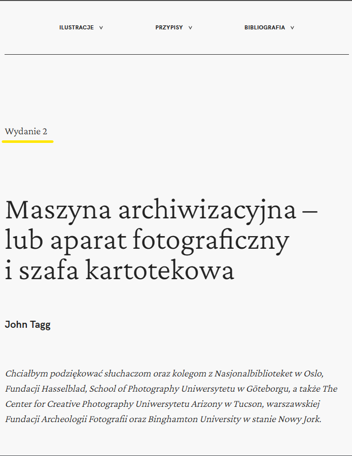

# Publication guidelines

This template supports both single and multi-author publications. The guidelines will point out the differences when necessary.

Template is multi-lingual therefore all markdown files should have an file extension of `.[locale].mdx` with possible locales as of now being `en` and `pl`.

In case the need for support of other languages arises notify the developer to add them.

## File structure

The publication files should be stored in the `/publication` folder of the project.

There are couple ways a publication can be structured:

1. Chapters or articles are stored shallowly in the `/publication` folder as markdown files along with images and other asset files.

   Therefore a folder can look like the following:

   publication  
   ┣ chapter_1.en.mdx  
   ┣ chapter_1.pl.mdx  
   ┣ chapter_2.en.mdx  
   ┣ chapter_2.pl.mdx  
   ┣ chapter_3.en.mdx  
   ┣ chapter_3.pl.mdx  
   ┣ bibliography.en.mdx  
   ┣ bibliography.pl.mdx  
   ┣ image_1.png  
   ┗ image_2.jpg

   Assets could also be stored in s subfolders for the ease of distinction

   publication  
   ┣ chapter_1.en.mdx  
   ┣ chapter_1.pl.mdx  
   ┗ images  
   ┃ ┣ example.png  
   ┃ ┗ test.jpg

   This folder structure however, only supports a **single** author publications because of the way the bibliography file is stored. More on bibliographies in the **Bibliogrpahy** section.

2. Chapters or articles are stored in separate folders along with their assets and biliographies.

   Therefore a folder can look like the following:

   publication  
    ┣ chapter_1  
    ┃ ┣ images  
    ┃ ┃ ┣ image_1.png  
    ┃ ┃ ┗ image_2.jpg  
    ┃ ┣ bibliography.en.mdx  
    ┃ ┣ bibliography.pl.mdx  
    ┃ ┣ index.en.mdx  
    ┃ ┗ index.pl.mdx  
    ┣ chapter_2
   ┃ ┣ images  
    ┃ ┃ ┣ image_3.png  
    ┃ ┃ ┗ image_4.jpg  
    ┃ ┣ bibliography.en.mdx  
    ┃ ┣ bibliography.pl.mdx  
    ┃ ┣ index.en.mdx  
    ┃ ┗ index.pl.mdx  
    ┣ images  
    ┃ ┗ reappearing_image.png

   This file configuration supports **single** and **multi** author publications. The name of the folder is the url to the chapter and the markdown context inside needs to be then named `index` in order for the app to render the pages properly. Bibliographies can be stored in the separate chapter/article folders if the publication is multi-author or like in the case of the point 1 at the root of the `/publication` folder. More on bibliographies in the **Bibliogrpahy** section.

## Chapter/article

Main markdown files that render as pages with support for various components that can be seen in **Components** section.

### Frontmatter

The chapter/article frontmatter needs to contain the following.

```mdx
---
title: [Title of the chapter/article]
index: [Index of an article eg. 1.1 in case of Part 1 - Chapter 1]
---
```

It can also contain the following fields.

```mdx
---
author: [Author of the publication]
summary: [A small description of the chapter/article].
headerImage: [relative path to the header image file]
embeddedImagesLocal:
- [relative path to the header image file]
- [relative path to the header image file]
- [relative path to the header image file]
---
```

- `headerImage` - inclusion of this field will render a header image for the chapter/article
- `embeddedImagesLocal` - include this field with the list of images for further use with components displaying pictures

## Bibliography

Bibliography can be publication wide rendered as a page or chapter/article wide rendered within the article menu.

### Frontmatter

The bibliography frontmatter needs to contain the following fields.

```mdx
---
meta: true
locale: [language of the file ("en" | "pl")]
---
```

### Single author bibliopgraphy

The bibliography is stored in the root of the `/publication` folder named `bibliography.[locale].mdx`. It is possible to use all the same components that are available in the chapter/article files.

The developer needs to set the `SINGLE_AUTHOR_MODE` flag to `true`.

### Multi author bibliography

Thei bibliography is stored in the chapter/article folders named `bibliography.[locale].mdx`. It is possible to use all the same components that are available in the chapter/article file. The effect may not always be right for things like carousels etc. since they are not rendered in the article/chapter view.

## Components

### Edition

It's a self contained component that can be put in the article in case support for versioning is in place.

#### **Preview**



#### **Usage snippet**

```mdx
<Edition />
```

### Author

Can be used to display the author in a formatted way.

#### **Preview**


#### **Usage snippet**

```mdx
<Author>Name of the author</Author>
```

### Abstract

Can be used to display the abstract of a chapter/artcile in a standout way.

#### **Preview**


#### **Usage snippet**

```mdx
<Author>Name of the author</Author>
```

### Annotation

Used to place an annotation in the text.

#### **Preview**


#### **Usage snippet**

Given the text

```
Part of text that I want to annotate.
```

and a desired annotation of **annotate** with **This is an example annotation content.**

The component should be used like so.

```mdx
Part of text I want to <Annotation target="annotate">This is an example annotation content.</Annotation>
```

### Quote

Used to place quotes in the text.

#### **Preview**


#### **Usage snippet**

Given the qauthor **Agnes Vardy** and a quote **This is an example quote.** the compnent should be used like so:

````mdx
<Quote author="Agnes Vardy">This is an example quote.</Quote>
```
````

### ViewportImage

A picture that will span the eniterty of the viewport height. It is possible to give it a caption and a longer one to be shown after expansion.

#### **Preview**


#### **Usage snippet**

Given the frontmatter from below

```mdx
---
embeddedImagesLocal:
  - images/image1.png
---
```

and short caption of **An example fig caption.** with the expanded version of **An example expanded caption** the usage sould look like the following.

````mdx
<ViewportImage image={props.localImages[0]} caption="An example fig caption">
  An example expanded caption.
</ViewportImage>
```
````

In order to pick the image from the list of images in frontmatter count the position in the list from 0.

### Carousel

A picture that will span the eniterty of the viewport height. It is possible to give it a caption and a longer one to be shown after expansion.

#### **Preview**


#### **Usage snippet**

Given the frontmatter from below

```mdx
---
embeddedImagesLocal:
  - images/image_1.png
  - images/image_2.jpg
  - images/image_3.png
---
```

the usage sould look like the following.

````mdx
<Carousel
  images={[props.localImages[0], props.localImages[1], props.localImages[2]]}
  captions={[
    "Caption for image 1",
    "Caption for image 2",
    "Caption for image 3",
  ]}
/>
```
````

Pick images from the list of images by counting indexes from 0 and place them in the square brackets one after the other separated by commas. Captions can be added by placing them in square brackets within quotation marks and separated by commas. The captions and images are matched by the order.

### Header image

In order to add a header image to the chapter/article place a path to it in the frontmatter like so:

```
---
headerImage: images/example.png
---
```
