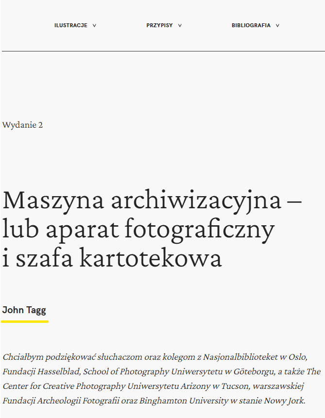
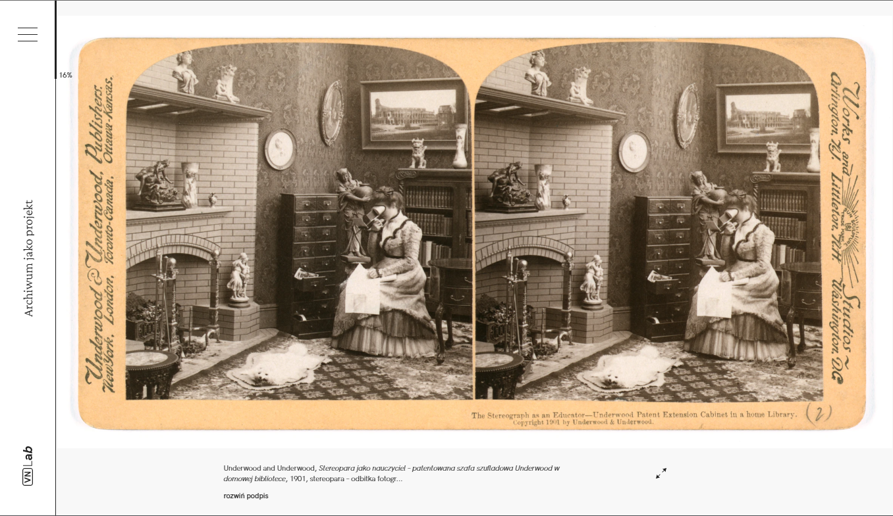
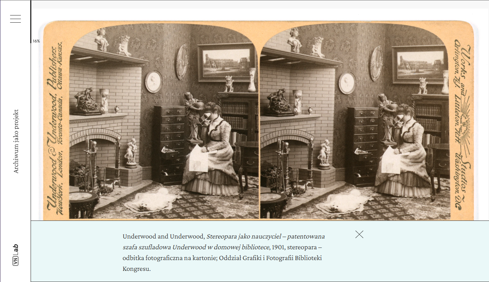
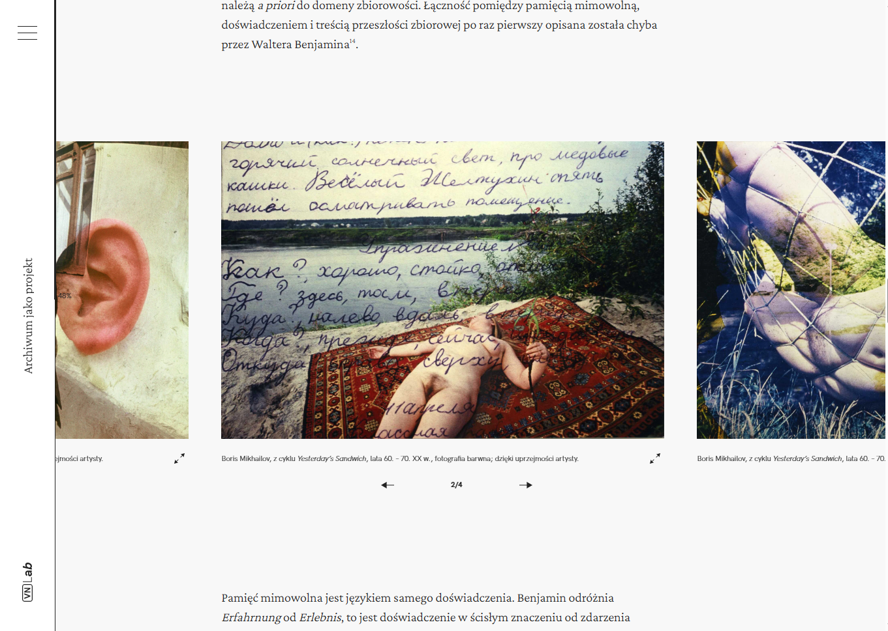

# Publication guidelines

This template supports both single and multi-author publications. The guidelines will point out the differences when necessary.

## Publication checklist

Apart from compiling the contents of the publication in markdown files there are some additional things worth taking care of:

- [ ] Define all the required fields in `publication/publication.config.json`.
- [ ] Add a customized favicon to `static/images` with `favicon3.png` name.
- [ ] Provide images to be displayed as social media link covers under `static/images` with the name of `card_[locale].png` for each language used in the publication.

> If your publication includes a theme change remember to provide the developer with the [theme_color](https://developer.mozilla.org/en-US/docs/Web/Manifest/theme_color) and [background_color](https://developer.mozilla.org/en-US/docs/Web/Manifest/background_color) to be included in the manifest.

## File structure

Template is multi-lingual therefore all markdown files should have an file extension of `.[locale].mdx`. You can configure available locales from withing the `publication/publication.config.json`.

The publication files should be stored in the `publication` folder of the project. Most publications will have the following file structure.

```
📦publication
 ┣ 📂chapters - contents of chapters and articles
 ┃ ┣ 📂chapter_1
 ┃ ┃ ┣ 📂images
 ┃ ┃ ┃ ┣ 📷0_image.jpeg
 ┃ ┃ ┃ ┣ 📷1_image.jpeg
 ┃ ┃ ┃ ┣ 📷2_image.jpeg
 ┃ ┃ ┃ ┣ 📷3_image.jpeg
 ┃ ┃ ┃ ┣ 📷4_image.jpeg
 ┃ ┃ ┃ ┗ 📷5_image.jpeg
 ┃ ┃ ┣ videos
 ┃ ┃ ┃ ┣ 🎬0_video.mp4
 ┃ ┃ ┃ ┗ 🎬1_video.mp4
 ┃ ┃ ┣ 📜bibliography.en.mdx
 ┃ ┃ ┣ 📜bibliography.pl.mdx
 ┃ ┃ ┣ 📜index.en.mdx
 ┃ ┃ ┗ 📜index.pl.mdx
 ┣ 📂meta - contents of about section in menu and hypothesis tutorial page
 ┃ ┣ 📜about_project.en.mdx
 ┃ ┣ 📜about_project.pl.mdx
 ┃ ┣ 📜hypothesis_tutorial.en.mdx
 ┃ ┗ 📜hypothesis_tutorial.pl.mdx
 ┣ 📜config.schema.json - configuration schema (do not alter)
 ┗ 📜publication.config.json - configuration file for the publication
```

Folder structure of the publication can only be altered within the `chapters` folder. There are couple ways in which chapters can be structured:

1. Chapters or articles are stored shallowly in the `publication/chapters` folder as markdown files along with images and other asset files.

   Therefore a folder can look like the following:

    <details>
    <summary>See shallow folder structure</summary>
    <p>

   ```
   📦publication
    ┣ 📂chapters - contents of chapters and articles
    ┃ ┃ ┣ 📜chapter_1.en.mdx
    ┃ ┃ ┣ 📜chapter_2.pl.mdx
    ┃ ┃ ┣ 📜chapter_3.pl.mdx
    ┃ ┃ ┣ 📜chapter_4.pl.mdx
    ┃ ┃ ┣ 📷0_image.jpeg
    ┃ ┃ ┣ 📷1_image.jpeg
    ┃ ┃ ┣ 📷2_image.jpeg
    ┃ ┃ ┣ 📷3_image.jpeg
    ┃ ┃ ┣ 📷4_image.jpeg
    ┃ ┃ ┣ 🎬0_video.mp4
    ┃ ┃ ┣ 🎬1_video.mp4
    ┃ ┃ ┣ 📜bibliography.en.mdx
    ┃ ┃ ┣ 📜bibliography.pl.mdx
   ```

    </p>
    </details>

   Assets could also be stored in subfolders for the ease of distinction

    <details>
    <summary>See shallow folder structure with assets in subfolders</summary>
    <p>

   ```
   📦publication
    ┣ 📂chapters - contents of chapters and articles
    ┃ ┃ ┣ 📜chapter_1.en.mdx
    ┃ ┃ ┣ 📜chapter_2.pl.mdx
    ┃ ┃ ┣ 📜chapter_3.pl.mdx
    ┃ ┃ ┣ 📜chapter_4.pl.mdx
    ┃ ┣ 📂images
    ┃ ┃ ┃ ┣ 📷0_image.jpeg
    ┃ ┃ ┃ ┣ 📷1_image.jpeg
    ┃ ┃ ┃ ┣ 📷2_image.jpeg
    ┃ ┃ ┃ ┣ 📷3_image.jpeg
    ┃ ┃ ┃ ┗ 📷4_image.jpeg
    ┃ ┣ 📂videos
    ┃ ┃ ┃ ┣ 🎬0_video.mp4
    ┃ ┃ ┃ ┗ 🎬1_video.mp4
    ┃ ┃ ┣ 📜bibliography.en.mdx
    ┃ ┃ ┣ 📜bibliography.pl.mdx
   ```

    </p>
    </details>

> ⚠ This folder structure, only supports a **single** author publications because of the way the bibliography file is stored. More on bibliographies in the **Bibliogrpahy** section.

2. Chapters or articles are stored in separate folders along with their assets and biliographies.

   Therefore a folder can look like the following:

     <details>
     <summary>See shallow folder structure with assets in subfolders</summary>
     <p>

   ```
   📦publication
    ┣ 📂chapters - contents of chapters and articles
    ┃ ┣ 📂chapter_1
    ┃ ┃ ┣ 📂images
    ┃ ┃ ┃ ┣ 📷0_image.jpeg
    ┃ ┃ ┃ ┣ 📷1_image.jpeg
    ┃ ┃ ┣ videos
    ┃ ┃ ┃ ┣ 🎬0_video.mp4
    ┃ ┃ ┃ ┗ 🎬1_video.mp4
    ┃ ┃ ┣ 📜bibliography.en.mdx
    ┃ ┃ ┣ 📜bibliography.pl.mdx
    ┃ ┃ ┣ 📜index.en.mdx
    ┃ ┃ ┗ 📜index.pl.mdx
    ┃ ┣ 📂chapter_2
    ┃ ┃ ┣ 📂images
    ┃ ┃ ┃ ┣ 📷0_image.jpeg
    ┃ ┃ ┃ ┣ 📷1_image.jpeg
    ┃ ┃ ┣ videos
    ┃ ┃ ┃ ┣ 🎬0_video.mp4
    ┃ ┃ ┃ ┗ 🎬1_video.mp4
    ┃ ┃ ┣ 📜bibliography.en.mdx
    ┃ ┃ ┣ 📜bibliography.pl.mdx
    ┃ ┃ ┣ 📜index.en.mdx
    ┃ ┃ ┗ 📜index.pl.mdx
    ┃ ┣ 📂images
    ┃ ┃ ┃ ┣ 📷0_reappearing_image.jpeg
   ```

     </p>
     </details>

   This file configuration supports **single** and **multi** author publications. The name of the folder is the url to the chapter and the markdown context inside needs to be then named `index` in order for the app to render the pages properly.

   Bibliographies can be stored in the separate chapter/article folders if the publication is multi-author or like in the case of the point 1 at the root of the `publication` folder. More on bibliographies in the **Bibliogrpahy** section.

## Chapter/article

Main markdown files that render as pages with support for various components that can be seen in **Components** section.

Information on how to compose graphical chapters can be found [here](/docs/graphical-chapters.md).

### Frontmatter

The chapter/article frontmatter needs to contain the following.

```mdx
---
title: [Title of the chapter/article]
index: [Index of an article eg. 1.1 in case of Part 1 - Chapter 1]
---
```

It can also contain the following fields.

```mdx
---
author: [Author of the publication]
summary: [A small description of the chapter/article].
headerImage: [relative path to the header image file]
embeddedImagesLocal:
- [relative path to the image file]
- [relative path to the image file]
- [relative path to the image file]
embeddedAudioLocal:
  - {
      src: [relative path to the image file],
      title: "Dłuższy lub krótszy tytuł",
      author: "Osoba autorska",
    }
---
```

- `headerImage` - inclusion of this field will render a header image for the chapter/article
- `embeddedImagesLocal` - include this field with the list of images for further use with components displaying pictures
- `embeddedAudioLocal` - include this field with the list of audio files for further use with components displaying audio

## Bibliography

Bibliography can be publication wide rendered as a page or chapter/article wide rendered within the article menu.

### Frontmatter

The bibliography frontmatter needs to contain the following fields.

```mdx
---
meta: true
locale: [language of the file ("en" | "pl")]
---
```

### Single author bibliopgraphy

The bibliography is stored in the root of the `publication/chapters` folder named `bibliography.[locale].mdx`. It is possible to use all the same components that are available in the chapter/article files.

The `singleAuthorMode` flag needs to be set to `true` in the `publication/publication.config.json`.

### Multi author bibliography

Thei bibliography is stored in the chapter/article folders named `bibliography.[locale].mdx`. It is possible to use all the same components that are available in the chapter/article file. The effect may not always be right for things like carousels etc. since they are not rendered in the article/chapter view.

## Components

All markdown syntax is supported within the chapter/article files and will show up in appropriately styled manner within the article. Look at the example article to see how things render.

Below are additional componets and syntax that can be used within the chapter/article.

### Edition

It's a self contained component that can be put in the article in case support for versioning is in place. It will display the current version of the publication.

#### **Preview**

<details>
<summary>See preview</summary>
<p>


</p>
</details>

#### **Usage snippet**

```mdx
<Edition />
```

### Author

Can be used to display the author in a formatted way.

#### **Preview**

<details>
<summary>See preview</summary>
<p>



</p>
</details>

#### **Usage snippet**

```mdx
<Author>Name of the author</Author>
```

or

```mdx
<Author link="/author_link">Name of the author</Author>
```

### Abstract

Can be used to display the abstract of a chapter/artcile in a standout way.

#### **Preview**

<details>
<summary>See preview</summary>
<p>


</p>
</details>

#### **Usage snippet**

```mdx
<Abstract>
  Lorem ipsum dolor sit amet, consectetur adipiscing elit, sed do eiusmod tempor
  incididunt ut labore et dolore magna aliqua. Ut enim ad minim veniam, quis
  nostrud exercitation ullamco laboris nisi ut aliquip ex ea commodo consequat.
  Duis aute irure dolor in reprehenderit in voluptate velit esse cillum dolore
  eu fugiat nulla pariatur. Excepteur sint occaecat cupidatat non proident, sunt
  in culpa qui officia deserunt mollit anim id est laborum.
</Abstract>
```

### Quote

An additional way to render quotes alongside the normal markdown quote syntax.

#### **Preview**

<details>
<summary>See preview of Quote </summary>
<p>


</p>
</details>

<details>
<summary>Compare with markdown syntax blockquote (>)</summary>
<p>


</p>
</details>

### ViewportImage

A picture that will span the eniterty of the viewport height. It is possible to give it a caption, which will cut off after 150 characters and show an `expand caption` button that will reveal full caption.

#### **Preview**

<details>
<summary>See viewport image</summary>
<p>



</p>
</details>

<details>
<summary>See viewport image with expanded caption</summary>
<p>



</p>
</details>

#### **Usage snippet**

Given the frontmatter from below

```mdx
---
embeddedImagesLocal:
  - images/image1.png
---
```

and caption of "_Lorem ipsum dolor sit amet, consectetur adipiscing elit, sed do eiusmod tempor
incididunt ut labore et dolore magna aliqua._".

````mdx
<ViewportImage
  image={props.localImages[0]}
  caption="Lorem ipsum dolor sit amet, *consectetur adipiscing* elit, sed do eiusmod tempor
  incididunt ut labore et dolore magna aliqua."
/>
```
````

In order to pick the image from the list of images in frontmatter count the position in the list from 0.

### Carousel

A picture that will span the eniterty of the viewport height. It is possible to give it a caption and a longer one to be shown after expansion.

#### **Preview**

<details>
<summary>See preview</summary>
<p>



</p>
</details>

#### **Usage snippet**

Given the frontmatter from below

```mdx
---
embeddedImagesLocal:
  - images/image_1.png
  - images/image_2.jpg
  - images/image_3.png
---
```

the usage sould look like the following.

````mdx
<Carousel
  images={[props.localImages[0], props.localImages[1], props.localImages[2]]}
  captions={[
    "Caption for image 1",
    "Caption for image 2",
    "Caption for image 3",
  ]}
/>
```
````

Pick images from the list of images by counting indexes from 0 and place them in the square brackets one after the other separated by commas. Captions can be added by placing them in square brackets within quotation marks and separated by commas. The captions and images are matched by the order.

### Header image

In order to add a header image to the chapter/article place a path to it in the frontmatter like so:

```
---
headerImage: images/example.png
---
```

#### **Preview**

<details>
<summary>See preview</summary>
<p>


</p>
</details>

### Audio

Audio component can be used to display an audio file.

#### **Usage snippet**

Given the frontmatter from below

```mdx
---
embeddedAudioLocal:
  - {
      src: "./sample-3s.mp3",
      title: "Dłuższy lub krótszy tytuł",
      author: "Osoba autorska",
    }
---
```

the usage sould look like the following.

```mdx
<Audio audio={props.localAudio[0]} />
```

Pick audio from the list of audio files by counting indexes from 0 and place them in the square brackets one after the other separated by commas.

## Syntax

Publication supports some custom syntax alongisde custom components that can be used in the chapter/article to render footntoes or mark indexed words and phrases.

---

### Footnotes

Footnotes can be added by appending the `:{{^number}}` to the end of the word in a markdown file and referencing it withing the footnores block at the end of the file with `{{^1}}:`

Given the example of:

```mdx
Lorem ipsum dolor sit amet, consectetur adipiscing elit. Suspendisse aliquam ante arcu, a maximus libero dignissim vitae. Sed consequat gravida tellus, sit amet ultricies mauris tempor non. Vivamus sodales pharetra porta. Nulla et lorem orci. Maecenas commodo nisl viverra felis feugiat semper. Fusce augue diam, egestas quis pulvinar eget, malesuada et turpis. Quisque tristique blandit faucibus. Donec in nibh ac nulla tincidunt faucibus. Sed tempus augue sit amet ligula iaculis interdum. Nullam facilisis mi sit amet vulputate auctor. Donec ante odio, commodo vitae bibendum at, laoreet id lorem. Cras ut laoreet augue.
```

adding a footnote would look like the following:

````mdx
Lorem ipsum dolor sit amet, consectetur:{{^1}} adipiscing elit. Suspendisse aliquam ante arcu, a maximus libero dignissim vitae. Sed consequat gravida tellus, sit amet ultricies mauris tempor non. Vivamus sodales pharetra porta. Nulla et lorem orci. Maecenas commodo nisl viverra felis feugiat semper. Fusce augue diam, egestas quis pulvinar eget, malesuada et turpis. Quisque tristique blandit faucibus:{{^2}}. Donec in nibh ac nulla tincidunt faucibus. Sed tempus augue sit amet ligula iaculis interdum. Nullam facilisis mi sit amet vulputate auctor. Donec ante odio, commodo vitae bibendum at, laoreet id lorem. Cras ut laoreet augue.

```footnotes
{{^1}}: Donec commodo odio eu molestie tincidunt.
{{^2}}: Pellentesque ut mauris id nibh posuere tincidunt sit amet eu erat.
```
````

### Indexes

Indexing words and phrases in the publication can be done by wrapping the phrase in brackets `()` and appending `:{{#tag}}` to the end for example `(John Smith):{{#people}}`. In order to preserve the base form of the phrase in the indexes you can alias the displayed text by providing the alias after `|` like so `(John Smith's|John Smith):{{#people}}`. This will make sure that in the `people` tab of indexes all entries for `John Smith` are under the same form. Essentially the syntax is `(phrase|alias):{{#tag}}`.

<details>
<summary>See example in text</summary>
<p>

```mdx
(John Smith):{{#people}} is a an exemplaty citizen of the world. (John Smith's|John Smith):{{#people}} first appearance on the show was in October. During his live performance, (John):{{#people}} stole the hearts of people in the audience.
```

</p>
</details>

## Internationalization

In order to change a language of the publication you need to define it in the `languages` field of the `publication/publication.config.json` and provide necessary metadata under a key that matches the locale key. You will see an example of a configuration when you open the file.

> Note: Default locale needs have it's `startUrl` defined as `/`

You also need to make similar adjustments to the locales in the `i18n/config.json` file.

## Themeing

You can customize the theme of the project by adjusting properties in the `src/styles/theme.ts` file.

You can select publication to follow only one theme by setting the `theme` property in `publication.config.json`

### Fonts

In order to add new fonts to the project you can adjust the `gatsby-plugin-web-font-loader` plugin in `gatsby-config.ts` file.

#### Google Fonts

You can use any fonts from Google Fonts by passing in a name and fonts variants after a column. See example below:

```ts
{
  resolve: "gatsby-plugin-web-font-loader",
  options: {
    google: {
      families: [`Crimson Pro:300,400,500,600,700,800,900&display=swap`],
    },
  },
},
```

#### Custom Fonts

In order to add custom fonts you need to do several things.

1. Add them to the `static/fonts` folder.
2. Define all variants in the `static/fonts/fonts.css` file
3. Add the font definition to the `gatsby-plugin-web-font-loader` plugin in `gatsby-config.ts` file. See example below.
4. Change the fonts definitions in `src/styles/theme.ts` under `theme.typography.fonts` key.

```ts
{
  resolve: "gatsby-plugin-web-font-loader",
  options: {
    custom: {
      families: [`HK-Grotesk:n3,n4,n5,n7`],
      urls: [`/fonts/fonts.css`],
    },
  },
},
```

> Note: The url to the font should be defined as if you were treating `static` folder as root.
